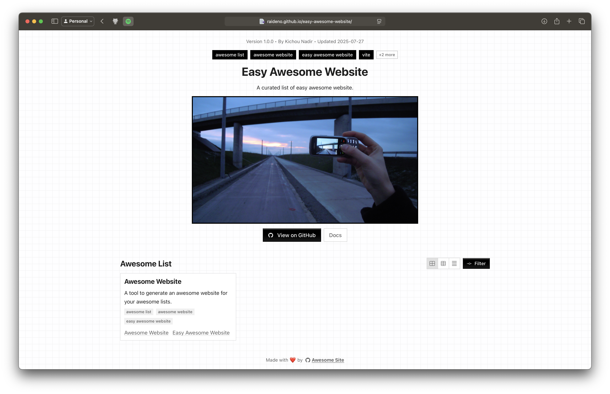

# Easy Awesome Website

**[Demo:](https://raideno.github.io/easy-awesome-website/)** [https://raideno.github.io/easy-awesome-website](https://raideno.github.io/easy-awesome-website/)

1. **Clone the Template Repository:** At the top right click on the "Use this Template" button.
2. **Enable Github Pages:** On your repository's settings, on the **Pages** section, select **GitHub Actions** under **Source**.
3. **Work on your list:** Modify the [list.yaml](./list.yaml) file according to your needs.
4. **Tadam!:** Push your modifications, wait a bit and you'll see the changes appear on `https://<your-username>.github.io/<your-repository-name>/`.

To know more about the structure of the [`list.yaml`](./list.yaml) file, please visit the [Awesome Website Repository](https://github.com/raideno/awesome-website).
